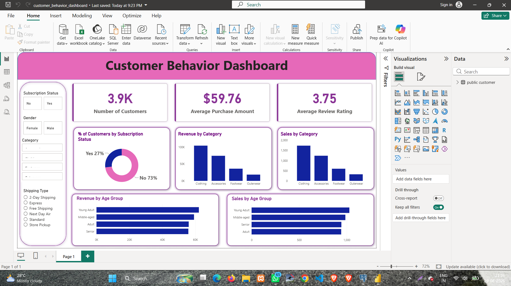

# 🛍️ Customer Shopping Behavior Analysis

## 📊 End-to-End Data Analytics Project | Python • SQL • PostgreSQL • Power BI

This project analyzes customer shopping behavior to understand purchasing patterns, customer segments, product performance, discount usage, subscription behavior, shipping preferences, and revenue trends.

The project covers the complete data analytics workflow:

**📂 Raw Data → 🐍 Python → 🧹 Data Cleaning → 🔎 EDA → 🗄️ PostgreSQL → 💻 SQL Analysis → 👥 Customer Segmentation → 📊 Power BI Dashboard → 💡 Business Insights**

---

## 📑 Table of Contents

- 🎯 Project Overview
- 💼 Business Problem
- 🎯 Project Objectives
- 📂 Dataset
- 🛠️ Tools & Technologies
- 🔄 Project Workflow
- 🐍 Python Data Analysis
- 🧹 Data Cleaning & Preprocessing
- 🔎 Exploratory Data Analysis
- 🗄️ PostgreSQL Database Integration
- 💼 Business Problems
- 💻 SQL Business Analysis
- 👥 Customer Segmentation
- 🏆 Product Analysis
- 📊 Power BI Dashboard
- 💡 Key Insights
- 🎯 Business Recommendations
- 📁 Project Structure
- 🚀 How to Run the Project
- 🧠 Skills Demonstrated
- 🏁 Project Outcome
- 👨‍💻 Author

---

# 🎯 Project Overview

The **Customer Shopping Behavior Analysis** project is an end-to-end data analytics project built to understand how customers purchase products and how different customer characteristics affect sales and revenue.

The analysis combines Python, PostgreSQL, SQL, and Power BI to turn raw customer transaction data into useful business insights.

### 🔑 Main Areas Covered

- 👥 Customer behavior
- 💰 Revenue analysis
- 🛍️ Product performance
- 🏷️ Category performance
- 🎟️ Discount behavior
- 🚚 Shipping preferences
- ⭐ Review ratings
- 🔔 Subscription behavior
- 🔄 Repeat purchases
- 👤 Customer segmentation
- 📊 Age-group analysis

---

# 💼 Business Problem

Retail businesses collect large amounts of customer transaction data, but raw data does not directly explain customer behavior or business performance.

This project uses customer shopping data to answer practical business questions such as:

- Which gender contributes more revenue?
- Which customers use discounts but still spend above average?
- Which products receive the highest ratings?
- Do customers using different shipping methods spend differently?
- Do subscribers spend more than non-subscribers?
- Which products are most frequently purchased with discounts?
- How many customers are New, Returning, or Loyal?
- What are the top products within each category?
- Are repeat buyers more likely to subscribe?
- Which age groups contribute the most revenue?

The goal is to convert these questions into SQL analysis and present the results through an interactive Power BI dashboard.

---

# 🎯 Project Objectives

The main objectives of the project are:

- 📥 Load and understand the raw customer dataset
- 🧹 Clean and preprocess the data
- 🔎 Perform exploratory data analysis using Python
- 🗄️ Store the cleaned data in PostgreSQL
- 💻 Solve business problems using SQL
- 👥 Segment customers based on previous purchases
- 🏆 Identify top-performing products
- 💰 Analyze revenue and sales
- 🎟️ Analyze discount behavior
- 🔔 Analyze subscription behavior
- 🚚 Compare shipping methods
- ⭐ Analyze product ratings
- 📊 Build an interactive Power BI dashboard
- 💡 Generate business insights
- 🎯 Provide business recommendations

---

# 📂 Dataset

The project uses a customer shopping behavior dataset containing information about customers, products, purchases, reviews, discounts, shipping, and subscriptions.

## 📋 Important Columns

| Column | Description |
|---|---|
| `customer_id` | Unique customer identifier |
| `age` | Customer age |
| `gender` | Customer gender |
| `item_purchased` | Product purchased |
| `category` | Product category |
| `purchase_amount` | Purchase amount |
| `review_rating` | Customer review rating |
| `shipping_type` | Shipping method |
| `discount_applied` | Whether a discount was applied |
| `subscription_status` | Subscription status |
| `previous_purchases` | Number of previous purchases |
| `age_group` | Customer age segment |

---

# 📊 Power BI Dashboard

The final analysis is presented through an interactive Power BI dashboard designed to provide a quick overview of customer behavior, purchasing patterns, subscription status, category performance, and customer demographics.

## 🖼️ Dashboard Preview



---

## 📌 Key Performance Indicators (KPIs)

The dashboard begins with three high-level KPIs that provide a quick summary of the customer base, purchasing behavior, and customer satisfaction.

### 👥 Total Customers — 3.9K

The dashboard contains approximately **3.9K customers**.

This KPI provides the overall size of the customer base being analyzed and acts as the starting point for understanding the scale of the business data.

### 💵 Average Purchase Amount — $59.76

The average purchase amount is **$59.76**.

This KPI represents the typical transaction value in the dataset and provides a baseline for evaluating customer spending behavior.

It can also be used as a reference when comparing different customer segments, categories, shipping methods, or subscription groups.

### ⭐ Average Review Rating — 3.75 / 5

The overall average review rating is **3.75 out of 5**.

This KPI provides a high-level view of customer satisfaction with the products purchased. A rating of 3.75 indicates generally positive customer feedback while also showing that there is room for improving the overall customer experience.

---

## 🔎 Interactive Dashboard Filters

The dashboard allows users to dynamically explore customer behavior using the following filters:

- 🔔 **Subscription Status** — Compare subscribers and non-subscribers.
- 👤 **Gender** — Analyze customer behavior by gender.
- 🏷️ **Category** — Analyze sales and revenue for individual product categories.
- 🚚 **Shipping Type** — Compare customer behavior across shipping methods.

These filters make the dashboard interactive and allow business users to move from overall performance to more specific customer segments.

---

## 📊 Dashboard Analysis

### 🔔 Subscription Status

The dashboard shows:

- **73% Non-Subscribers**
- **27% Subscribers**

The large proportion of non-subscribers indicates an opportunity to increase subscription adoption.

From a business perspective, existing customers can be targeted with subscription benefits such as exclusive offers, personalized promotions, or shipping benefits.

---

### 💰 Revenue by Category

The dashboard compares revenue generated by the major product categories.

The observed ranking is:

1. 🥇 **Clothing**
2. 🥈 **Accessories**
3. 🥉 **Footwear**
4. **Outerwear**

**Clothing is the strongest revenue-generating category** in the dashboard.

This makes Clothing an important category for inventory planning, promotions, product recommendations, and cross-selling opportunities.

---

### 🛒 Sales by Category

The category sales visualization shows a similar pattern:

1. 🥇 **Clothing**
2. 🥈 **Accessories**
3. 🥉 **Footwear**
4. **Outerwear**

The consistency between sales and revenue indicates that Clothing is not only generating higher revenue but is also receiving stronger customer demand in terms of sales volume.

---

### 👴 Revenue by Age Group

The dashboard compares revenue contribution across different age groups.

The observed ranking is:

1. 🥇 **Young Adult**
2. 🥈 **Middle-aged**
3. 🥉 **Adult**
4. **Senior**

**Young Adult customers contribute the highest revenue** among the displayed age groups.

This suggests that Young Adults are an important customer segment and could be a useful target for personalized campaigns and product recommendations.

---

### 🛍️ Sales by Age Group

The sales analysis also highlights **Young Adults** as the strongest-performing age group.

This consistency between sales and revenue indicates that Young Adults are not only purchasing more frequently but are also contributing significantly to overall revenue.

---

# 💡 Key Business Insights

The dashboard and SQL analysis provide several important insights:

### 1. 🔔 Subscription Opportunity

With **73% of customers being non-subscribers**, the business has a large existing customer base that could potentially be converted into subscribers.

### 2. 🛍️ Clothing Is the Leading Category

Clothing ranks first in both sales and revenue, making it the strongest-performing category in the dashboard.

### 3. 👥 Young Adults Are a Key Customer Segment

Young Adults contribute the highest sales and revenue among the displayed age groups, making them an important segment for targeted marketing.

### 4. 💵 Average Transaction Value

The average purchase amount of **$59.76** provides a benchmark for evaluating customer spending patterns and comparing different segments.

### 5. ⭐ Customer Satisfaction

The average review rating of **3.75/5** indicates generally positive customer feedback, while also highlighting potential room for improving products and customer experience.

### 6. 📊 Category Performance Is Consistent

The category ranking for sales and revenue is broadly similar, with Clothing leading and Outerwear contributing the least among the displayed categories.

### 7. 🎟️ Discounted High-Value Customers

The SQL analysis identifies customers who used discounts but still spent at or above the overall average purchase amount. This helps identify customers who generate relatively high-value purchases even when discounts are applied.

### 8. 🔄 Repeat Buyers and Subscription Behavior

The SQL analysis also examines customers with more than five previous purchases and compares their subscription status. This helps investigate whether repeat purchasing is associated with subscription adoption.

---

# 🎯 Business Recommendations

Based on the dashboard and SQL analysis, the following recommendations can be considered:

### 🔔 1. Increase Subscription Conversion

Since most customers are non-subscribers, the business can target suitable existing customers with:

- Exclusive subscriber discounts
- Personalized offers
- Early access to products
- Free or faster shipping

### 🛍️ 2. Prioritize High-Performing Categories

Clothing is the strongest category in both sales and revenue.

The business can focus on:

- Maintaining inventory availability
- Promoting best-selling products
- Cross-selling related products
- Improving product recommendations

### 👥 3. Target Young Adult Customers

Young Adults show the strongest sales and revenue contribution.

Marketing strategies can include:

- Personalized recommendations
- Targeted promotions
- Seasonal campaigns
- Product bundles

### 🎟️ 4. Optimize Discount Strategy

Discounts should be targeted rather than applied broadly.

The business can identify products and customers where discounts contribute to higher purchase activity while avoiding unnecessary reduction in revenue.

### ⭐ 5. Improve Customer Experience

With an average rating of **3.75/5**, businesses can analyze customer feedback to identify opportunities related to:

- Product quality
- Shipping experience
- Customer service
- Product expectations

### 🚚 6. Evaluate Shipping Behavior

The dashboard's shipping filter and SQL analysis allow the business to compare customer spending across shipping types and understand whether shipping preferences are associated with different purchase behavior.
# 🛠️ Tools & Technologies

## 🐍 Python

Used for:

- Data loading
- Data cleaning
- Data preprocessing
- Exploratory Data Analysis
- Feature engineering

### Libraries

- Pandas
- NumPy
- Matplotlib
- Seaborn

---

## 🗄️ PostgreSQL

Used for:

- Storing cleaned data
- Creating the customer table
- Running SQL queries
- Performing business analysis

---

## 💻 SQL

Used for:

- Aggregations
- Filtering
- Grouping
- Sorting
- Subqueries
- CTEs
- CASE statements
- Conditional aggregation
- Window functions

---

## 📊 Power BI

Used for:

- KPI cards
- Revenue analysis
- Sales analysis
- Subscription analysis
- Category analysis
- Age-group analysis
- Interactive filtering
- Dashboard visualization

---

## 🔗 Other Technologies

- SQLAlchemy
- Psycopg2
- Jupyter Notebook
- Git
- GitHub

---

# 🔄 Project Workflow

```text
📂 Raw Customer Dataset
          ↓
🐍 Python
          ↓
🧹 Data Cleaning & Preprocessing
          ↓
🔎 Exploratory Data Analysis
          ↓
🗄️ PostgreSQL
          ↓
💻 SQL Business Analysis
          ↓
👥 Customer Segmentation
          ↓
🏆 Product Analysis
          ↓
📊 Power BI Dashboard
          ↓
💡 Business Insights
          ↓
🎯 Business Recommendations
